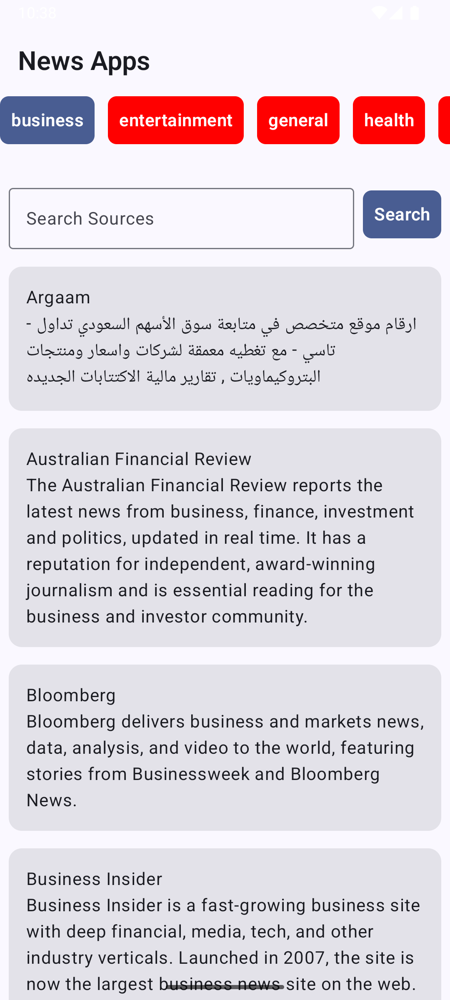

# Aplikasi Berita




Ini adalah aplikasi berita sederhana untuk Android, yang dibuat menggunakan praktik pengembangan Android modern. Aplikasi ini memungkinkan pengguna untuk menelusuri kategori berita, melihat sumber berita dalam kategori yang dipilih, dan membaca artikel dari sumber yang dipilih.

## Fitur

-   **Menjelajahi Kategori Berita:** Pengguna dapat melihat daftar kategori berita seperti Bisnis, Hiburan, Olahraga, dll.
-   **Melihat Sumber Berita:** Setelah memilih kategori, aplikasi akan menampilkan daftar sumber berita untuk kategori tersebut.
-   **Mencari Sumber:** Pengguna dapat mencari sumber berita tertentu.
-   **Melihat Artikel:** Pengguna dapat melihat daftar artikel dari sumber berita yang dipilih.
-   **Membaca Artikel Lengkap:** Mengetuk sebuah artikel akan membuka cerita lengkapnya di WebView.
-   **Scrolling Tak Terbatas:** Artikel dan sumber dimuat secara progresif saat pengguna menggulir.

## Arsitektur

Aplikasi ini mengikuti prinsip-prinsip **Clean Architecture**, yang memisahkan kepentingan menjadi tiga lapisan utama: Presentasi, Domain, dan Data. Hal ini mendorong aplikasi yang lebih kuat, terukur, dan dapat diuji.

### 1. Lapisan Presentasi

Lapisan ini bertanggung jawab atas UI dan menangani interaksi pengguna. Lapisan ini dibuat menggunakan **Jetpack Compose**, perangkat modern Android untuk membangun UI native.

-   **Views (Composables):** Layar dibuat menggunakan fungsi composable. Layar utama meliputi:
    -   `CategoryScreen`: Menampilkan daftar kategori berita.
    -   `SourceScreen`: Menampilkan sumber berita berdasarkan kategori yang dipilih.
    -   `ArticleScreen`: Menampilkan daftar artikel dari sumber yang dipilih.
    -   `ArticleDetailScreen`: Menampilkan artikel lengkap dalam `WebView`.
-   **ViewModels:** `CategoryViewModel`, `SourcesViewModel`, dan `ArticlesViewModel` bertanggung jawab untuk mempersiapkan dan mengelola data untuk UI. Mereka berinteraksi dengan lapisan Domain (Use Cases) dan mengekspos state ke UI menggunakan `StateFlow`.
-   **Navigasi:** Navigasi antar layar ditangani menggunakan **Jetpack Navigation for Compose**.

### 2. Lapisan Domain

Ini adalah lapisan logika bisnis inti dari aplikasi. Lapisan ini independen dari kerangka kerja Android mana pun.

-   **Use Cases/Interactors:** Kelas-kelas ini berisi logika bisnis yang spesifik.
    -   `GetCategoriesUseCase`: Mengambil daftar kategori.
    -   `GetSourcesUseCase`: Mengambil sumber berita untuk kategori tertentu.
    -   `GetArticlesUseCase`: Mengambil artikel dari sumber tertentu.
-   **Repository Interface (`NewsRepository`):** Mendefinisikan kontrak untuk operasi data, mengabstraksi sumber data dari lapisan domain.

### 3. Lapisan Data

Lapisan ini bertanggung jawab untuk menyediakan data ke aplikasi.

-   **Repository Implementation (`NewsRepositoryImpl`):** Mengimplementasikan antarmuka `NewsRepository`. Ini mengambil data dari API jarak jauh.
-   **API Service (`NewsApiService`):** Menggunakan **Retrofit** untuk mendefinisikan endpoint dan membuat permintaan jaringan ke [NewsAPI](https://newsapi.org/).
-   **Model Data:** Objek transfer data (DTO) seperti `Article`, `Source`, dan `Category` digunakan untuk memodelkan respons API.

### Injeksi Ketergantungan

Injeksi Ketergantungan dikelola menggunakan **Koin**, yang membantu dalam memisahkan kelas-kelas dan mengelola siklus hidupnya. Aplikasi ini memiliki modul khusus untuk ViewModel, UseCase, dan layanan Repositori/API.

## Cara Membangun dan Menjalankan

1.  **Kloning repositori:**
    ```bash
    git clone [https://github.com/mochfajardev/apps_news.git]
    ```
2.  **Buka di Android Studio:** Buka proyek di versi terbaru Android Studio.
3.  **Kunci API:** Proyek ini menggunakan NewsAPI. Anda harus mendapatkan kunci API Anda sendiri. Kunci saat ini di-hardcode di `NewsRepositoryImpl.kt`.
4.  **Sinkronkan Gradle:** Biarkan Android Studio menyinkronkan proyek dan mengunduh dependensi yang diperlukan.
5.  **Jalankan aplikasi:** Bangun dan jalankan aplikasi di emulator Android atau perangkat fisik (min SDK 24).

## Teknologi dan Pustaka yang Digunakan

-   **[Kotlin](https://kotlinlang.org/)**: Bahasa pemrograman resmi untuk pengembangan Android.
-   **[Jetpack Compose](https://developer.android.com/jetpack/compose)**: Perangkat modern Android untuk membangun UI native.
-   **[Clean Architecture](https://blog.cleancoder.com/uncle-bob/2012/08/13/the-clean-architecture.html)**: Untuk struktur aplikasi yang kuat, terukur, dan dapat dipelihara.
-   **[Kotlin Coroutines](https://kotlinlang.org/docs/coroutines-overview.html)**: Untuk pemrograman asinkron.
-   **[Jetpack Compose Navigation](https://developer.android.com/jetpack/compose/navigation)**: Untuk menavigasi antar layar.
-   **[ViewModel](https://developer.android.com/topic/libraries/architecture/viewmodel)**: Untuk menyimpan dan mengelola data terkait UI secara sadar siklus hidup.
-   **[StateFlow](https://developer.android.com/kotlin/flow/stateflow-and-sharedflow)**: Untuk mengamati perubahan state di ViewModel.
-   **[Retrofit](https://square.github.io/retrofit/)**: Klien HTTP yang aman untuk Android dan Java.
-   **[Koin](https://insert-koin.io/)**: Kerangka kerja injeksi ketergantungan yang ringan dan pragmatis untuk Kotlin.
-   **[Coil](https://coil-kt.github.io/coil/)**: Pustaka pemuatan gambar untuk Android yang didukung oleh Kotlin Coroutines.
